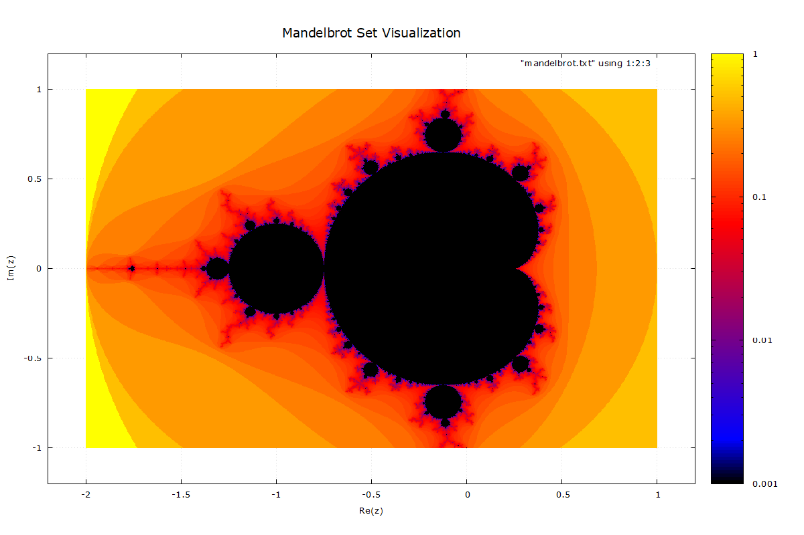

# Mandelbrot Set Visualization (OpenMP)

This project explores the Mandelbrot set using C++ and parallel computing.

## Features
- **Parallelization**: Uses OpenMP to distribute fractal calculations across multiple CPU cores.
- **Optimization**: Compiled with `-O3` for high-performance floating-point math.
- **Visualization**: Includes a Gnuplot script to generate high-resolution heatmaps.

## Performance
- **Processor**: Pentium Dual Core
- **Threads**: 2
- **Grid Size**: 1000x1000

## How to Compile
Using the MSYS2 UCRT64/MinGW64 toolchain:
```bash
g++ -fopenmp -O3 mandelbrot.cpp -o mandelbrot.exe
```

## How to plot
```bash
gnuplot mandelbrot_plot.plt
```
## 🐍 Python Implementations

In addition to the C++ core, I have added two Python implementations to explore the Mandelbrot set. These versions leverage **Matplotlib** for high-quality visualization and **Numba** for high-performance computing.

### 1. Basic Python (`mandelbrot.py`)
A straightforward, loop-based implementation using NumPy. 
* **Pros:** Clean code, easy to understand.
* **Cons:** Slow execution on large grids (interpreted overhead).
* **Best for:** Learning the mathematical logic of the escape-time algorithm.

### 2. Numba-Optimized Explorer (`mandelbrot_numba.py`)
This version uses **Just-In-Time (JIT) Compilation** and **Parallel Processing** to achieve speeds comparable to the C++/OpenMP version.

* **Performance:** Uses `@jit(nopython=True, parallel=True)` to compile Python code into machine code at runtime.
* **Dynamic Zoom:** Features an interactive explorer. Use the Matplotlib **Zoom Tool (Magnifying Glass)** to select an area; the script automatically re-calculates the fractal at 1000x1000 resolution for that specific coordinate range.
* **Visuals:** Uses `PowerNorm` and the `magma` colormap to highlight complex fractal structures along the "shoreline" of the set.

---

## 📸 Snapshot Gallery

Here are some snapshots generated using the **Numba Explorer**. These show the self-similarity of the Mandelbrot set at different zoom levels.

| Initial View | Deep Zoom (Spiral Valley) | Fractal Branching |
| :---: | :---: | :---: |
|  |  |  |

> **Note:** To see the high-resolution renders, run the `mandelbrot_numba.py` script and use the interactive zoom.

---

## 🛠️ Requirements & Usage

To run the Python versions, ensure you have the necessary libraries installed:

```bash
pip install numpy matplotlib numba